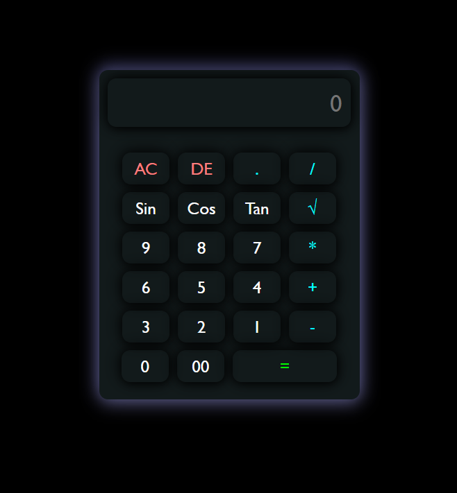

# 📌 Basic Calculator (HTML, CSS, JavaScript)

A simple and responsive **Basic Calculator** built using **HTML, CSS, and JavaScript**. This project performs basic arithmetic operations like addition, subtraction, multiplication, and division with a clean and user-friendly interface.

---

## 🚀 Features

* ➕ Addition
* ➖ Subtraction
* ✖️ Multiplication
* ➗ Division
* 🧹 Clear (AC) button
* ⌫ Delete (DEL) button
* 📱 Responsive design (Mobile + Desktop)

---

## 🛠️ Technologies Used

* **HTML** – Structure of the calculator
* **CSS** – Styling and layout
* **JavaScript** – Logic and functionality

---

## 📂 Project Structure

```
calculator/
│── index.html
│── style.css
│── script.js
```

---

## ⚙️ How It Works

1. User clicks on numbers and operators.
2. Input is displayed on the screen.
3. JavaScript processes the expression.
4. Press `=` to get the result.
5. Use:

   * `AC` to clear all input
   * `DEL` to remove the last character

---

## 📸 Screenshot



---

## 💻 Getting Started

### 1. Clone the repository

```bash
git clone https://github.com/your-username/calculator.git
```

### 2. Open the project folder

```bash
cd calculator
```

### 3. Run the project

* Open `index.html` in your browser

---

## 💡 Future Improvements

* 🔢 Add scientific calculator functions
* 🌙 Dark/Light mode toggle
* ⌨️ Keyboard input support

---

## 🤝 Contributing

Contributions are welcome! Feel free to fork this repository and submit a pull request.

---

<!-- ## 📄 License

This project is open-source and available under the **MIT License**.

--- -->

## 🙌 Acknowledgements

This project is created for learning and practice purposes.
